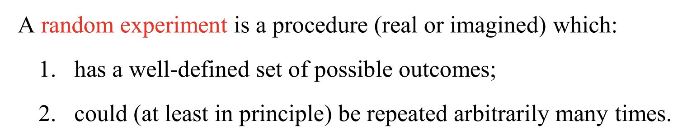
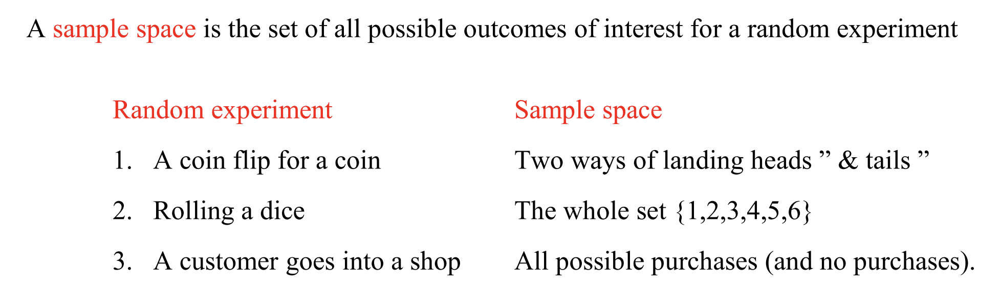
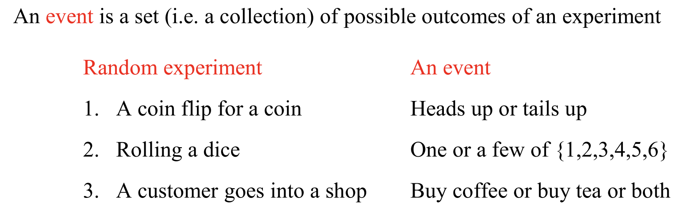
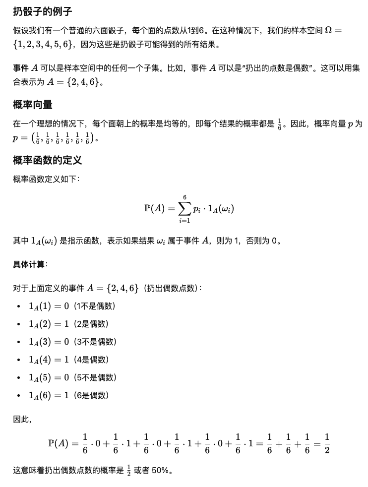

**Random Experiment:**
  

**Sample Space:**
  

**Event: 指从一个Random Experiment中Sample Space的子集; 我们通常研究的Event是那些我们感兴趣的结果组成的集合.**
  

$$ x \in A $$, $x$ 是集合 $A$ 的一个元素.
$$ x \notin A $$, $x$ 不是集合 $A$ 的一个元素.

**给定一个集合 $A$ 和一个性质 $F$, ${ x \in A: F(x) }$ 来表示 集合 A 中所有满足性质 $F$ 的 $x$ 元素 **.

**如果 $A$ 是 $B$ 的子集, 写作$A \subseteq B$**.

**The complement of B in A is $A \setminus B := \{ x \in A \mid x \notin B \}$ (斜线看成减号)**. 

**{1, 2, 3, 4, 5} \ {0, 1, 2, 3} = {4, 5}**

**对于样本空间 $\Omega$ 中的事件 $A$, 事件 $A$ 的补集是指 $A$ 不发生时的事件. 用$A^c$来表示**.

**Indicator function: Let $A \subseteq \Omega$ be a set (or event). We can associate $A$ with a binary function $1_A: \Omega \rightarrow \{0,1\}$ by**

$
1_A(\omega) = \begin{cases} 
1 & \text{if } \omega \in A \\
0 & \text{if } \omega \notin A
\end{cases}
$

**The function $1_A$ is referred to as the indicator function of $A$**.

**通过这种指示函数, 可以将"集合的运算"转化为"函数的运算", 简化问题**.

**有限概率空间由三个基本部分组成: $(\Omega, \mathcal{E}, \mathbb{P})$**.

Specify a vector $p = (p_1, p_2, \ldots, p_k)$ that satisfying:
1. $p_i \geq 0$ for $i = 1, 2, \ldots, k.$
2. $\sum_{i=1}^k p_i = 1$

Define a probability $\mathbb{P}$ based on $p$ by:
$$
\mathbb{P}(A) := \sum_{i=1}^k p_i \cdot 1_A(\omega_i) \quad \text{for } A \subseteq \Omega
$$

By definition, we have $\mathbb{P}(\omega_i) = p_i$ for any $\omega_i \in \Omega$.   

  

**分布 (Distribution) 是用来描述随机变量 X 取不同值的概率的一个函数**.

**X是扔骰子的结果, X的可能值是{1, 2, 3, 4, 5, 6}, $P_X(\{3\})$ 就是骰子结果为3的概率.**

